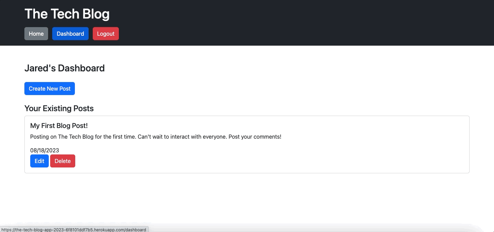

# The Tech Blog

## Table of Contents

1. [Description](#description)
2. [Usage](#usage)

3. [Installation](#installation)
4. [Contributing](#contributing)

5. [Tests](#tests)

6. [License](#license)

7. [Questions](#questions)

## Description

Tech Blog application that allows users to post and comment to collaborate with others

## Usage

Sign-Up/Log into website, you'll be presented with your own dashboard that allows you to create posts and then you can also comment on others as well.

Heroku URL: https://the-tech-blog-app-2023-6f8101ddf7b5.herokuapp.com/

## Installation

Clone repository

Install packages (npm install)

Set-up your environment variable specific to you

Start server (node server.js)

Access through localhost or deploy to Heroku (among others)

## Contributing

Not Applicable at this time

## Tests

Sign-Up/Login

Create Posts, Delete Posts

Add Comments to other Posts

Sign Out

## License

This project is licensed under the [MIT](https://opensource.org/licenses/MIT) license.

## Questions

Find me on GitHub: [EliteHuskie](https://github.com/EliteHuskie)

Contact me at: [EliteHuskie@gmail.com](mailto:EliteHuskie@gmail.com)

